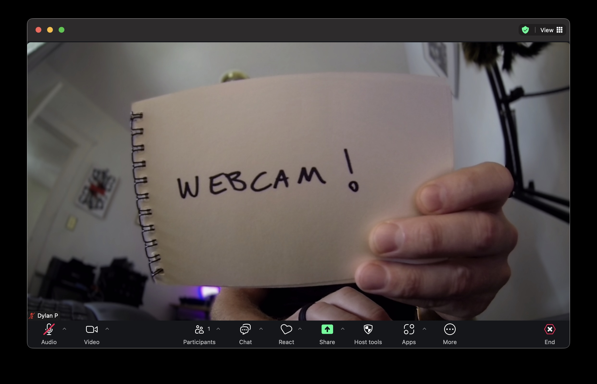

# h3bcam

Turn a GoPro HERO3 Black into a real USB webcam - no capture card required.



This repo contains a patch for GoPro HERO3 Black firmware to create a real UVC
webcam, 1280×960@30fps. Once it's patched, no additional software or drivers
are needed - works everywhere you'd expect.

> [!WARNING]
> This sofware is not endorsed by, created by, or affiliated with  GoPro. All
> trademarks are property of GoPro, Inc. This repository does not include the
> original firmware, which is copyrighted property of GoPro.
> 
> Though well-tested, limited to old low-value devices, and often recoverable -
> **modifying your firmware has inherent risks**, including permanently
> disabling your device. It also voids your warranty, if somehow you had one on
> a 15-year-old camera. By continuing, you accept these risks, and disclaim all
> liability from the authors of this patch. This patch requires a working macOS
> or Linux development environment, and we don't promise any support.

---

## Install

> [!IMPORTANT]
> If you want the option of restoring your original firmware exactly as-is, or
> to make things easier if something goes wrong, you can back up your device
> firmware first by following [`RECOVERY.md#Backing up your own
> firmware`](RECOVERY.md#Backing up your own firmware). This repo doesn't
> distribute those images, and GoPro's firmware downloads are the generic
> image, not guaranteed to be whatever was on your camera before.

Fetch the official GoPro firmware, apply the patch, then copy 3 files to your
microSD card. On next boot, your GoPro will apply the new firmware.

> Anything in `[square brackets]` below is a placeholder - substitute the
> correct path.

### 1. Build the package

You'll need GoPro's `HD3.03-firmware.bin`, from their [HERO3 Black update
ZIP](https://gopro.com/en/us/update/hero3), version **HD3.03.03.00**. Once
that's downloaded:

```sh
clang -target arm-none-eabi -march=armv6k -mfloat-abi=soft -c patch.s -o patch.o
python3 make_update.py --extract-pri stock.bin [path to HD3.03-firmware.bin]
python3 build.py stock.bin none uvclive_pri.bin -
python3 make_update.py [path to HD3.03-firmware.bin] uvclive_pri.bin sd-update stock.bin
```

`stock.bin` and `uvclive_pri.bin` are intermediate files created during build.
Your final outputs will live in `sd-update/`.

### 2. Copy files to the card

Plug the microSD card into your computer, and substitute the path below for its
mount location, e.g. `/Volumes/microSD/`

```sh
cp sd-update/HD3.03-firmware.bin sd-update/update.cmd sd-card/autoexec.ash [path to your SD card]
```

### 3. Insert card to camera, and boot

The camera should show an "updating" screen, may restart at least once, and then
powers off when complete. The camera marks the update files on the card as
complete when finished so they don't re-run; you can safely delete
`HD3.03-firmware.bin` and `update.cmd` afterwards to reclaim space.

---

## Use it

1. Power the camera on with the front power button, while **unplugged** from USB.
2. Wait for the camera to settle into Video mode; we cycle modes to apply the
   right encoding settings, which may take a few seconds.
3. Plug USB into your computer. It should appear as a universal USB webcam with
   identifier `4255:0007`.

---

## What the patches do

Stock firmware **already contains a complete UVC implementation** — descriptors,
enumeration, PROBE/COMMIT, the bulk endpoint, payload headers, chunked transfer.
GoPro built it as a factory test fixture that streams a static JPEG off the SD
card, then left it disabled. The DSP's MJPEG encoder is fully implemented too.

In less than 1000 bytes, we can patch these pieces into place:

| # | address | what |
|---|---|---|
| 1 | `0xC07AD218` | Class-table slot 7 becomes "Ambarella Video", init pointed at our trampoline |
| 2 | `0xC0456128`, `0xC0456140`, `0xC0517A4C` | Three UVC-enable getters forced to `return 1` |
| 3 | `0xC0573840` | `beq` → `nop`. Streaming is gated on a test-JPEG load that always fails |
| 4 | `0xC030B830` | Stub to `return 0`, so plugging in USB doesn't tear down video preview |
| 5 | `0xC07DB2F8` | Point the active descriptor set at the real UVC class-0x0E set |
| 6 | `0xC07F8FF8` | Advertise one frame: 1280×960, 2 MiB buffer |
| 7 | `0xC0804C68`… | Probe controls: `dwMaxVideoFrameSize` → 2 MiB |
| 8 | `0xC0517808` | Revive `uvc_task_init`, which GoPro compiled out to a stub |
| 9 | `0xC0333618` | `b app_switch` → `bx lr`, so the 300 s power-saving timer can't switch the camera into Mass Storage mid-stream |
| 10 | `0xC061A000` | The injected blob (`patch.s`) |

The blob hooks the UVC COMMIT handler and runs a priority-120 worker: wait
for DSP op-mode 5, create an 8 MB bitstream ring, arm `dsp_mjpeg_encode` while
the host is streaming, and on every frame publish the encoder's buffer address
and length into the two words the bulk task reads.

Full detail, address map and struct layouts: [`TECHNICAL.md`](TECHNICAL.md).

---

## Troubleshooting

| symptom | cause |
|---|---|
| **Crashes**, or no usable video | Camera isn't in 960p/48fps — check `autoexec.ash` is on the card and ran. |
| **Nothing enumerates** | `autoexec.ash` missing or wrong. |
| Enumerates but **no frames** | USB plugged in before the camera returned to video mode. Power-cycle and wait. |
| Won't enumerate **at all** | Pull the battery for 5 s, reinsert. |

---

## Recovery & restoring original firmware

### The easy way

Delete the h3bcam files from your microSD card (`autoexec.ash`, and the update
files if you kept them), then follow GoPro's normal firmware update process with
their unmodified `HD3.03-firmware.bin`. That overwrites our patches with stock
and the camera goes back to behaving like any other HERO3.

This works as long as the camera still boots. If it does, you never need
anything below.

### If the camera won't boot

See [`RECOVERY.md`](RECOVERY.md)

---

## Credits

[`gopro-usb-tools`](https://github.com/evilwombat/gopro-usb-tools) was
indispensable; all development used evilwombat's USB bootrom loader or recovery
Linux image to load firmware. This isn't a dependency, but can be used to
restore original firmware afterwards in case of emergency.

Dissasembly and patches were largely the work of Claude Opus 5, over the course
of a week of experimentation.
